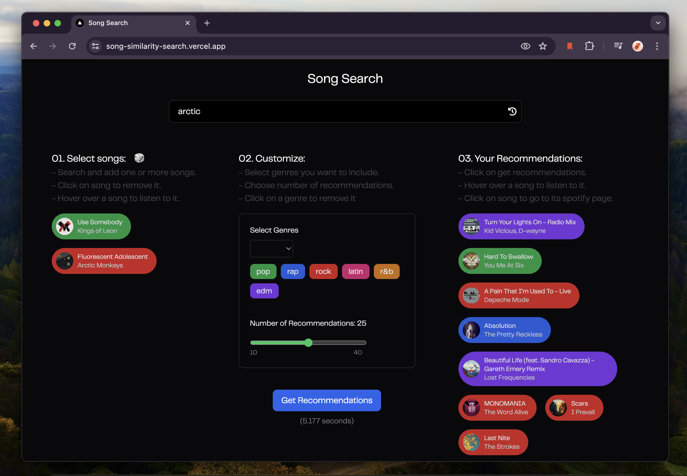

# Song Search
Song Search is a web application that recommends songs using similarity search.



## What is this?
Song search is an experiment in recommending songs to users using song embeddings. 

Song embeddings are a vector of normalized values of various song characteristics such as danceability, energy, key, loudness, mode, speechiness, acousticness, instrumentalness, liveness, valence, tempo.

Cosine similarity is used to compare, rank and retrieve top k similar songs

## Project Structure
- [Client](/client): Code for the nextjs frontend
- [Backend](/backend/): Python code running on aws lambda
- [Notebook](/notebook/): All of jupyter notebooks used for testing out ideas and data processing
- [Dataset](/dataset/): Primary [dataset](https://www.kaggle.com/datasets/joebeachcapital/30000-spotify-songs) used for this project

## Setup

Use scripts
```
chmod +x setup.sh
chmod +x run.sh
./setup.sh
./run.sh
```

or 

Run client locally
```bash
cd client
npm ci
npm run dev
```

Upload the backend/lambda code as a .zip in a aws lambda function

Create a .env.local file and add the following
```
NEXT_PUBLIC_LAMBDA=<URL of your lambda function>
```
